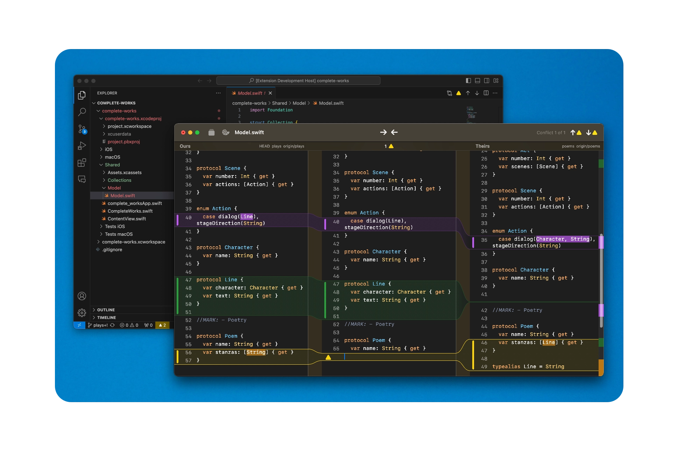
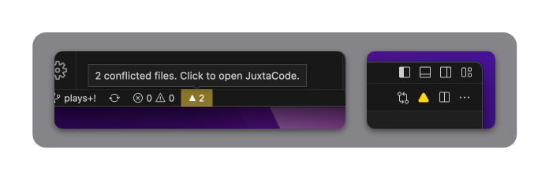

# JuxtaCode for Visual Studio Code

This extension provides integration between Visual Studio Code and [JuxtaCode](https://juxtacode.app), a native merge tool for macOS, to help resolve merge conflicts in your Git repositories.

## Features

This extension provides the following features:

- Status bar: Adds an item that displays the number of conflicted files in the current Git repository. Clicking on this item opens the repository in JuxtaCode.
- Editor header: If the current file is conflicted, adds a button to the editor header that opens the file in JuxtaCode's 3-way merge tool.
- Context menu: If the selected file is conflicted, adds an item to the context menu that opens the file in JuxtaCode's 3-way merge tool.

 

## Requirements

You need to have JuxtaCode installed on your Mac to make use of this extension.

## Usage

1. Install JuxtaCode on your macOS machine.
2. Install this extension.
3. Open a Git repository in Visual Studio Code.
4. If there are any conflicted files in the repository, the status bar item will display the number of conflicts. Clicking on the status bar item will open the repository in JuxtaCode.
5. If the current file is conflicted, an item will be added to the editor title that allows you to resolve the file with JuxtaCode. Clicking on the item will open the file in JuxtaCode's 3-way merge tool.
6. If you have a file selected that is conflicted, a context menu item will be added that allows you to resolve the file with JuxtaCode. Right-click on the file and select "Resolve with JuxtaCode" to open the file in JuxtaCode's 3-way merge tool.

## Known Issues

There are currently no known issues with this extension.

## Release Notes

### 1.1.1

Fixes a bug where merge tool would not open unless using the context menu from the source control section.

### 1.1.0

Switches to using universal links rather than AppleScript to communicate with JuxtaCode.

### 1.0.1

Fix meta data :|

### 1.0.0

Initial release.